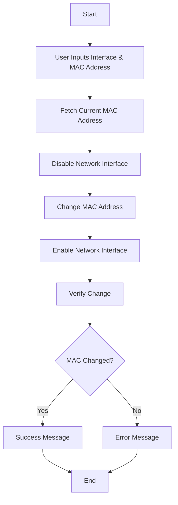

# 🛠 MAC Address Changer

A Python tool to change the MAC address of a network interface. This helps in improving anonymity and bypassing network restrictions.

## ⚠️ Disclaimer
- This tool is for educational purposes only.
- Ensure you have proper authorization before changing MAC addresses.

## 🚀 Features
- Change MAC address of any network interface.
- Validate MAC address changes.
- Simple command-line interface.

## 🛠 Requirements
- Python 3.x
- Linux-based OS (Tested on Kali Linux, Ubuntu)
- `ifconfig` utility

## 📦 Installation
Clone this repository:
```bash
git clone https://github.com/yourusername/mac-changer.git
cd mac-changer
```

## ▶️ Usage
Run the script with `sudo`:
```bash
sudo python3 mac_changer.py -i <interface> -m <new_mac>
```

### Example:
```bash
sudo python3 mac_changer.py -i eth0 -m 00:11:22:33:44:55
```

### Expected Output:
```
current MAC = xx:xx:xx:xx:xx:xx
[+] Changing MAC address for eth0 to 00:11:22:33:44:55
[+] MAC address was successfully changed to 00:11:22:33:44:55
```

## 🔍 Functionalities

### 1️⃣ Argument Parsing
The script accepts user inputs via command-line arguments:
- `-i / --interface`: Specify the network interface.
- `-m / --mac`: Provide the new MAC address.

### 2️⃣ Fetch Current MAC Address
Retrieves and displays the existing MAC address before making any modifications.

### 3️⃣ MAC Address Modification
- Disables the network interface.
- Updates the MAC address.
- Re-enables the interface for changes to take effect.

### 4️⃣ Verification
After modification, the script checks and confirms if the MAC address was successfully changed.

## 📊 Flow Diagram



## 📜 License
MIT License

## ✉️ Contact
For queries, reach out at [your_email@example.com](mailto:your_email@example.com).

Happy Hacking! 🚀
